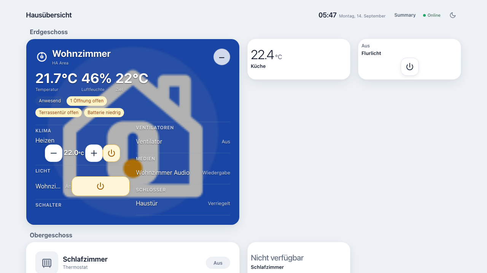
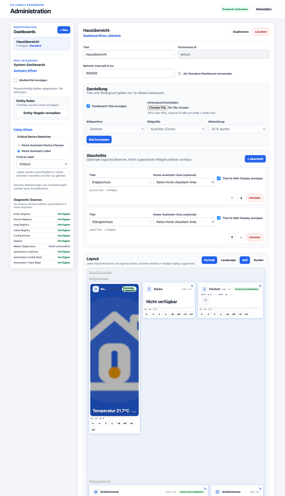
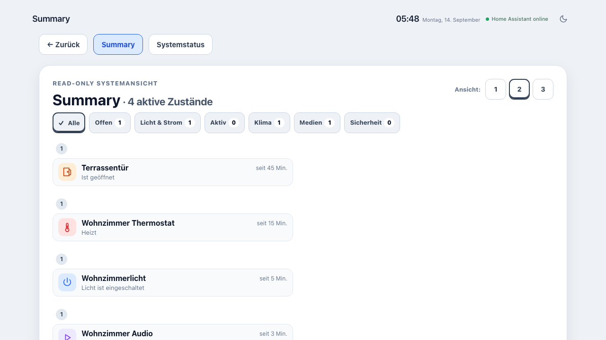
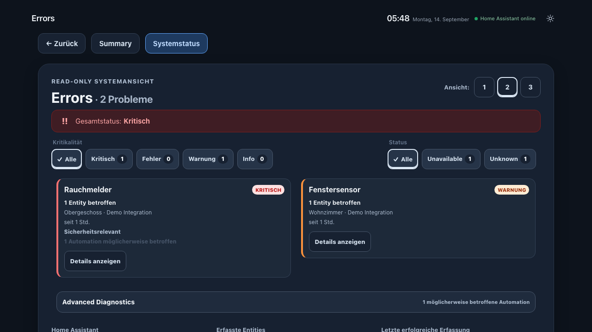

# HA Legacy Dashboard

Eine leichtgewichtige, externe Dashboard-Anwendung für Home Assistant – mit besonderem Fokus auf ältere Browser und dauerhaft installierte Wall-Displays.

## Überblick

`ha-legacy-dashboard` läuft als eigenständiges Node.js-/Express-Gateway außerhalb von Home Assistant.

```text
Legacy-Browser / Wall-Tablet
        |
        | HTTP
        v
HA Legacy Dashboard Gateway
Node.js + Express
        |
        | Home Assistant API
        v
Home Assistant
```

Das Projekt ist **kein Lovelace-Dashboard**, kein Custom Panel und kein internes Home-Assistant-Frontend. Der Home-Assistant-Token bleibt ausschließlich im Backend.

## Zielplattform

- Apple iPad mini 1
- iOS 9.3.5
- Safari unter iOS 9
- ECMAScript 5

Das Legacy-Frontend bleibt frameworkfrei und verwendet die vorhandene `Legacy.http`-/`XMLHttpRequest`-Kompatibilitätsschicht.

## Hauptfunktionen

### Benutzerdashboards

- mehrere Dashboards
- persistente Konfiguration
- konfigurierbare Widgets
- Drag-and-drop-Rasterlayout
- Portrait- und Landscape-Layouts
- konfigurierbare Card-Größen
- responsive Compact-/Normal-/Expanded-Darstellung
- Light- und Climate-Steuerung über explizit freigegebene Backend-Endpunkte
- Light/Dark Mode
- Stale-Data- und Reconnect-Verhalten

### Admin-Bereich

Unter `/admin` werden Dashboards und Widgets verwaltet.

Dazu gehören unter anderem:

- Dashboards erstellen, umbenennen, duplizieren und löschen
- Standard-Dashboard festlegen
- Entities auswählen
- Widgets hinzufügen und bearbeiten
- Sichtbarkeit und Reihenfolge
- Card-Größen
- Drag-and-drop-Layout
- Portrait-/Landscape-Layouts
- Live-Card-Vorschau
- Light-/Dark-Vorschau

### Summary Dashboard

```text
/system/summary
```

Zeigt aktuell relevante Zustände, z. B.:

- eingeschaltete Lichter
- relevante eingeschaltete Schalter
- offene Fenster und Türen
- aktive Cover
- laufende Saugroboter
- aktive Heiz-/Kühlvorgänge
- Medienwiedergabe

### Fehler-/Systemstatus-Dashboard

```text
/system/errors
```

Zeigt unter anderem:

- `unavailable`
- `unknown`
- sicherheitsrelevante Ausfälle
- Schweregrade
- Stale-/Offline-Zustände
- letzten erfolgreichen Aktualisierungszeitpunkt

`unknown` und `unavailable` werden bewusst getrennt behandelt.

## Sicherheitsmodell

Verbindlich:

- Home-Assistant-Token nur im Backend
- keine direkte Browser-Verbindung zu Home Assistant
- keine generische HA-Service-API
- Schreibzugriffe nur über explizite Backend-Endpunkte
- explizite Entity-/Service-Allowlists
- Sichtbarkeit einer Entity erzeugt keine Schreibberechtigung
- Admin-Token und HA-Token bleiben getrennt
- Rate Limits
- Payload Limits
- Security Header
- Secret Redaction

```text
Entity sichtbar != Entity schreibbar
```

## Legacy-Kompatibilität

Im Legacy-Frontend werden bewusst nicht verwendet:

- `fetch`
- `Promise`
- `async` / `await`
- arrow functions
- `let`
- `const`
- optional chaining
- nullish coalescing
- CSS Grid
- Flexbox `gap`
- ResizeObserver
- Container Queries

## Screenshots

Produkt-Screenshots müssen echte Aufnahmen der laufenden Anwendung oder einer kontrollierten Demo-/Mock-Instanz der echten Anwendung sein. Keine generierten Mockups als Produkt-Screenshot verwenden.

### Benutzerdashboards

```text
docs/screenshots/dashboards/main-light.png
docs/screenshots/dashboards/main-dark.png
docs/screenshots/dashboards/compact-cards.png
docs/screenshots/dashboards/focus-card.png
```

### Admin

```text
docs/screenshots/admin/dashboard-management.png
docs/screenshots/admin/layout-editor.png
docs/screenshots/admin/live-preview.png
```

### System-Dashboards

```text
docs/screenshots/system/summary.png
docs/screenshots/system/errors.png
```

Sobald die Dateien vorhanden sind, können sie hier eingebunden werden, z. B.:

```md




```

## Screenshot-Pflege

Bei jedem Sprint mit sichtbaren UI-Änderungen muss geprüft werden:

1. Hat sich eine dokumentierte Ansicht sichtbar geändert?
2. Ist ein vorhandener Screenshot veraltet?
3. Muss ein neuer Screenshot ergänzt werden?
4. Stimmen README-Verweise und Dateinamen noch?

Vor dem Commit prüfen:

- keine Tokens
- keine unerwünschten internen IP-Adressen
- keine privaten Personen-/Gerätenamen
- keine sicherheitskritischen Entity-Namen
- keine privaten Medieninformationen
- keine Standortdaten

Bevorzugt Demo-Entities oder bewusst freigegebene Namen verwenden.

## Empfohlene Screenshot-Struktur

```text
docs/
  screenshots/
    dashboards/
      main-light.png
      main-dark.png
      compact-cards.png
      focus-card.png
    admin/
      dashboard-management.png
      layout-editor.png
      live-preview.png
    system/
      summary.png
      errors.png
```

## Entwicklung

Vor Änderungen mindestens lesen:

```text
AGENTS.md
README.md
README.de.md
README.en.md
docs/CODEX_HANDOFF.md
docs/SPRINT_ROADMAP.md
docs/PROJECT_STATUS.md
```

Sprint-Spezifikationen:

```text
docs/sprints/
```

## Tests

Automatisierte Tests decken unter anderem Gateway, Dashboard-Konfiguration, Security, Climate, Light, Admin, Layout, System-Dashboards, Stale-/Offline-Verhalten und lokale Home-Assistant-Mocks ab.

Produktionscredentials dürfen niemals für lokale Integrationstests verwendet werden.

## Deployment

Der Standalone-Betrieb unterstützt Debian-basierte LXC-/VM-Systeme mit systemd. Die Architektur bleibt zusätzlich für eine spätere Home-Assistant-App-Verpackung geeignet.

## Projektstatus und Roadmap

- Technischer Stand: `docs/PROJECT_STATUS.md`
- Roadmap: `docs/SPRINT_ROADMAP.md`

## Sprache

- [English](README.en.md)
