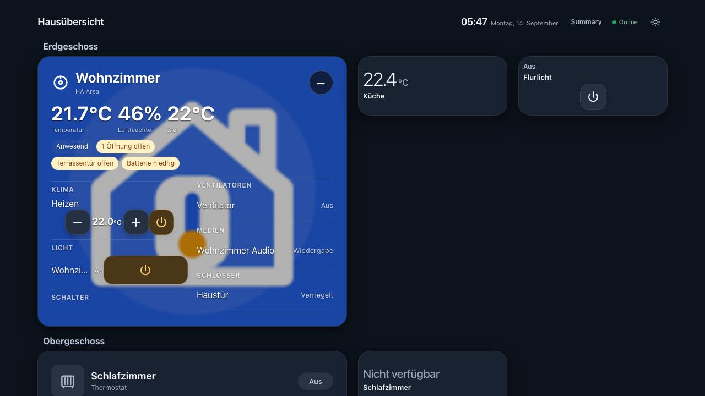
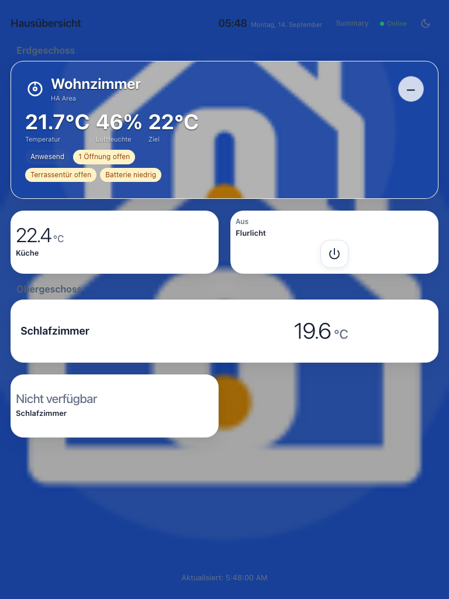
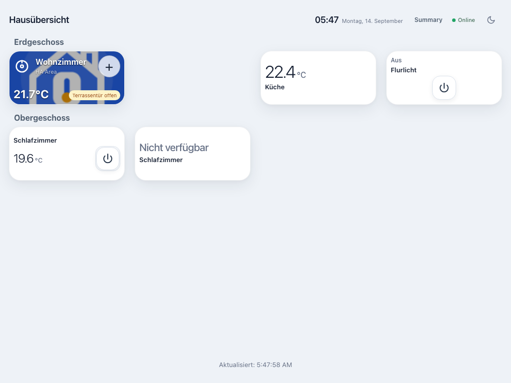
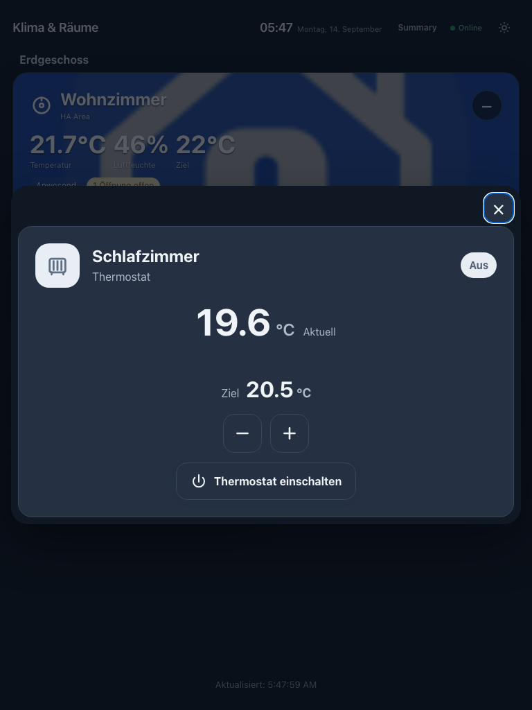
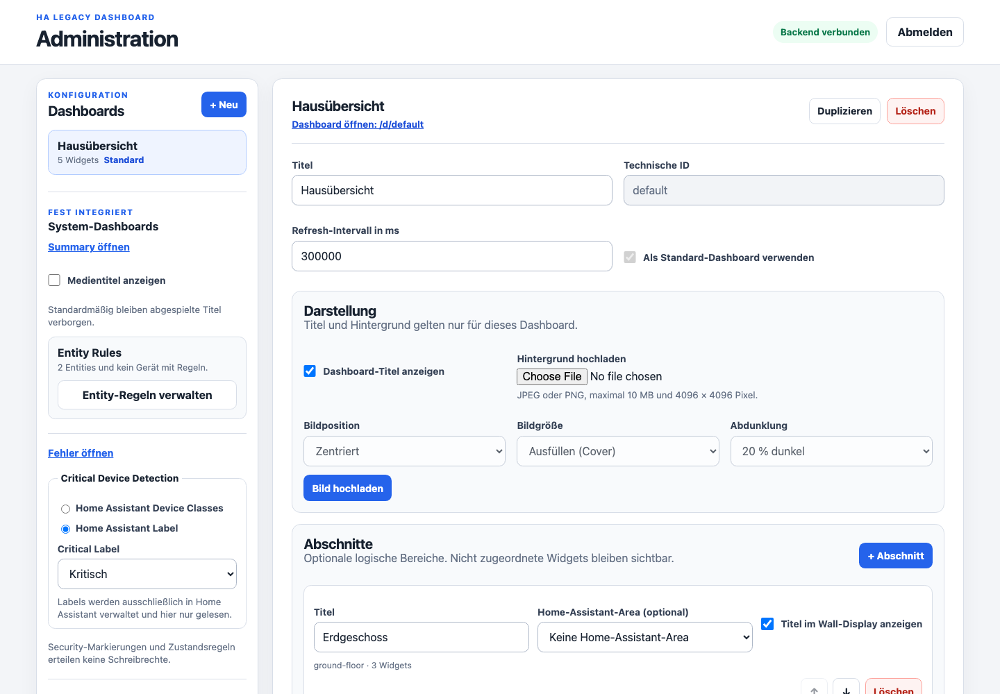
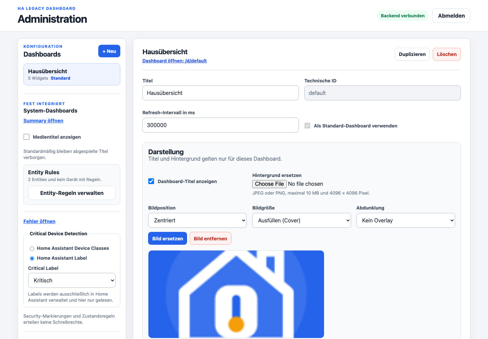
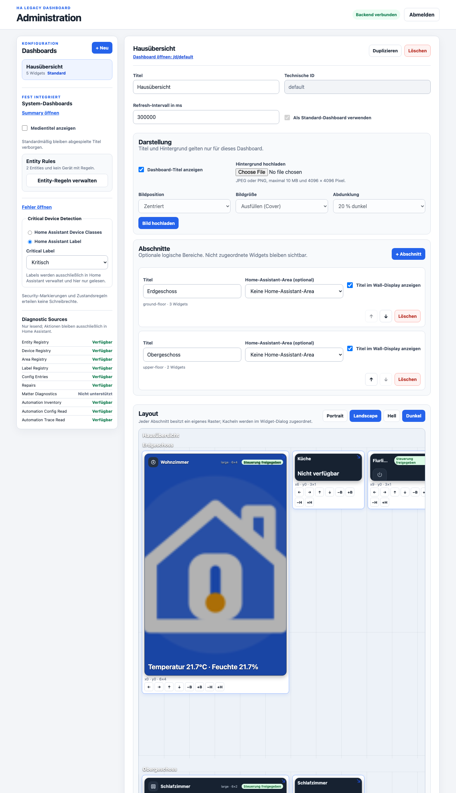
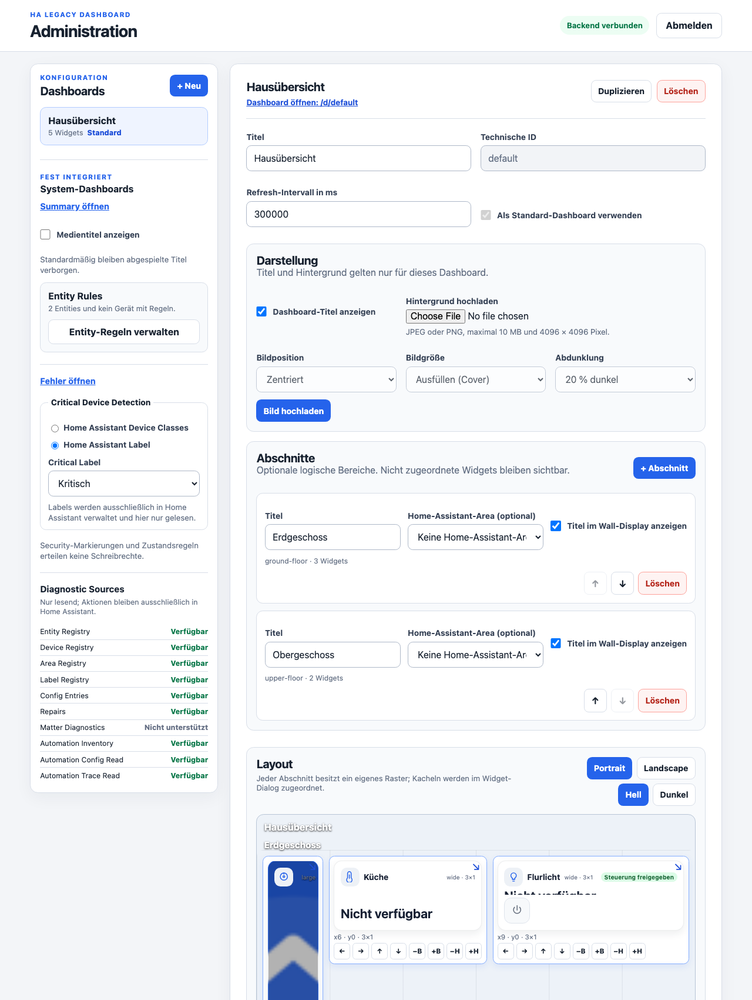
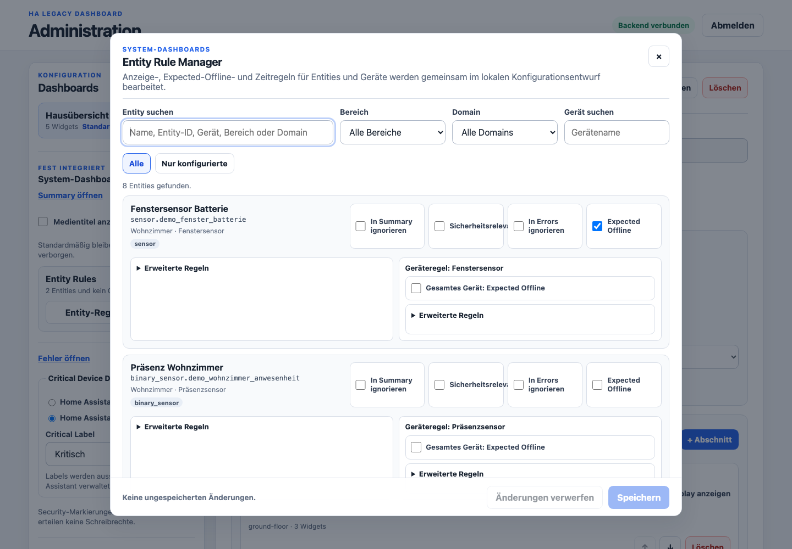
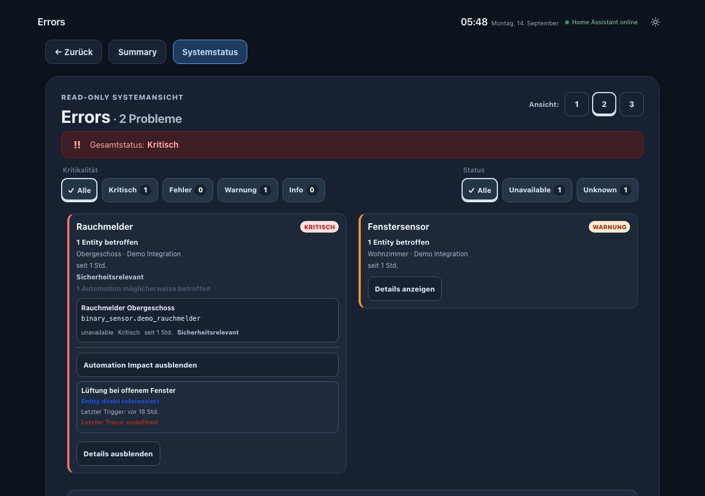

# HA Legacy Dashboard

Eine leichtgewichtige, externe Dashboard-Anwendung für Home Assistant – mit besonderem Fokus auf ältere Browser und dauerhaft installierte Wall-Displays.

## Überblick

`ha-legacy-dashboard` verwendet in beiden Betriebsarten dasselbe
Node.js-/Express-Gateway:

```text
Legacy-Browser / Wall-Tablet
        |
        | HTTP
        v
HA Legacy Dashboard Gateway
Node.js + Express
        |
        | Home Assistant API
        v
Home Assistant
```

- **Home Assistant App:** Home Assistant OS startet den Container. Das Backend
  verwendet ausschließlich den Supervisor-Core-REST-/WebSocket-Proxy und den
  serverseitigen `SUPERVISOR_TOKEN`; ein Long-Lived Access Token muss nicht
  manuell konfiguriert werden.
- **Standalone:** Node.js, LXC, VM oder Docker verwendet weiterhin `HA_URL`
  und den ausschließlich im Backend gespeicherten `HA_TOKEN`.

Das Projekt ist **kein Lovelace-Dashboard**, kein Custom Panel und kein internes Home-Assistant-Frontend. Der Home-Assistant-Token bleibt ausschließlich im Backend.

## Installationsart wählen

- **Home Assistant OS:** als benutzerdefinierte Home Assistant App über das
  [Custom App Repository hinzufügen](https://my.home-assistant.io/redirect/supervisor_add_addon_repository/?repository_url=https%3A%2F%2Fgithub.com%2Ftekky85%2Fha-legacy-dashboard).
- **LXC, VM oder eigener Linux-Server:** das versionierte Standalone-
  Release-Archiv von [GitHub Releases](https://github.com/tekky85/ha-legacy-dashboard/releases)
  verwenden.

Das Projekt ist ein Custom App Repository und keine offizielle Home-Assistant-
App.

## Zielplattform

- Apple iPad mini 1
- iOS 9.3.5
- Safari unter iOS 9
- ECMAScript 5

Das Legacy-Frontend bleibt frameworkfrei und verwendet die vorhandene `Legacy.http`-/`XMLHttpRequest`-Kompatibilitätsschicht.

## Hauptfunktionen

### Benutzerdashboards

- mehrere Dashboards
- persistente Konfiguration
- persistente, frei benennbare Abschnitte je Dashboard
- konfigurierbare Widgets
- Drag-and-drop-Rasterlayout
- Portrait- und Landscape-Layouts
- konfigurierbare Card-Größen
- responsive Compact-/Standard-/Wide-/Tall-/Large-Darstellung
- eigenständige, viewportbasierte Focus-Ansicht mit priorisierten Werten und Controls
- gemeinsames, SVG-basiertes Power-Control für Light und Climate in Grid und Focus
- Light- und Climate-Steuerung über explizit freigegebene Backend-Endpunkte
- ein eigenes JPEG-/PNG-Hintergrundbild je Standard- oder Custom-Dashboard
- wählbare Bildposition, Cover/Contain und optionale Abdunklung
- pro Dashboard ein- oder ausblendbarer Titel
- viewportfüllende Darstellung mit ruhigem Aktualisierungs-Footer am unteren
  Rand bei wenig Inhalt und normalem Scrollen bei vielen Cards
- Light/Dark Mode
- Stale-Data- und Reconnect-Verhalten

Light und Dark sind eine globale Browser-Präferenz für `/`, alle
`/d/<dashboard-id>`-Routen sowie Summary und Systemstatus. Die Auswahl wird
unter dem bestehenden Schlüssel `ha-legacy-theme` früh vor dem Rendern
geladen. Falls ein älteres Safari `localStorage` zwar anbietet, Schreibzugriffe
aber ablehnt, hält eine gleichnamige, nicht sensible Cookie-Kopie mit Root-Pfad
die Auswahl auch über Refresh und interne Navigation hinweg stabil. Wenn beide
Speicherwege fehlen, bleibt die laufende Ansicht bedienbar und stürzt nicht ab.

Jedes Standard- und Custom-Dashboard besitzt im Header eine neutrale, immer
sichtbare Summary-Navigation. Daneben erscheint ein kompakter
Error-/Health-Indikator nur bei `warning`, `error` oder `critical`. Reine
`info`-Hinweise lösen keinen Alarmindikator aus. Ein veralteter oder noch
unbekannter Health-Status bleibt dagegen sichtbar, damit ein fehlender Punkt
nur bei frischen, verlässlich unauffälligen Daten „alles in Ordnung“ bedeutet.

Summary und Systemstatus übernehmen den exakten internen Ausgangspfad als
validiertes Return-Ziel. Dadurch führen sie sowohl vom Standard-Dashboard als
auch von `/d/<dashboard-id>` zuverlässig zurück. Externe, protokollrelative,
unbekannte oder anderweitig ungültige Ziele werden server- und browserseitig
abgewiesen und fallen sicher auf `/` zurück. Der Indikator verwendet nur
`GET /api/system-dashboards/status` und dessen reduzierten Severity-Überblick;
vollständige Summary-/Error-Payloads werden für die Header-Navigation nicht
geladen.

Alle produktinternen Dashboard-, Summary-, Systemstatus- und Zurück-Links
verwenden validierte, root-relative Pfade und öffnen im selben Fenster. Das
hält auf älteren iPads auch beim Start über das HomeScreen-Icon denselben
Standalone-/Fullscreen-Kontext sowie Protokoll, Host und Port. Die direkte
LAN-Weboberfläche bleibt damit unabhängig von Home Assistant Ingress; interne
Navigation verwendet weder `target="_blank"` noch `window.open()`.

Dashboard-Hintergründe werden über den geschützten Admin-Bereich hochgeladen
und getrennt je Dashboard gespeichert. Das normale Wall-Display erhält nur
eine kontrollierte, read-only Bild-URL; weder der Datenpfad noch Tokens werden
offengelegt. Ein ausgeblendeter Titel entfernt nur seinen ungenutzten Platz.
Summary-Navigation, Health-Indikator, Verbindung und Theme-Umschalter bleiben
erreichbar.

Jedes Standard- und Custom-Dashboard kann optional in vertikal angeordnete
Abschnitte wie Räume, Etagen oder Funktionsgruppen gegliedert werden. Jeder
Abschnitt verwendet intern das bestehende Portrait-/Landscape-Raster und kann
seinen Titel ein- oder ausblenden. Widgets lassen sich zwischen Abschnitten
verschieben oder bewusst „Nicht zugeordnet“ belassen. Dashboards ohne
Abschnitte rendern unverändert im bisherigen Raster. Beim Löschen eines
Abschnitts bleiben alle Widgets erhalten und wechseln sicher in den nicht
zugeordneten Bereich.

Ein Abschnitt kann optional die ID einer vorhandenen Home-Assistant-Area als
read-only Metadatenreferenz speichern. Abschnitt und HA Area bleiben getrennte
Konzepte: Abschnitte funktionieren ohne Area, und das Dashboard erstellt,
benennt oder verändert niemals Home-Assistant-Areas.

### iPad mini als Wall-Display

Für ein einzelnes iPad mini 1 mit iOS 9.3.5 ist **Geführter Zugriff** der
empfohlene praktische Kioskmodus. Das Dashboard wird zuerst über sein
HomeScreen-Symbol gestartet und danach per Home-Dreifachklick gesperrt. Ein
normaler Druck auf die Home-Taste darf die Web-App dann nicht verlassen;
Berührung muss für Navigation sowie Light-/Climate-Controls aktiviert bleiben.

Geführter Zugriff ist kein garantierter Auto-Start-Kiosk nach iPad-Neustart
oder Stromverlust. Der Betreiber muss gegebenenfalls das Gerät entsperren, die
HomeScreen-Web-App erneut öffnen und die Sitzung neu starten. Für mehrere
zentral verwaltete Geräte ist Supervision plus Single App Mode/App Lock über
Apple Configurator oder MDM die strengere Alternative. Admin- oder Home-
Assistant-Credentials werden in keinem der beiden Fälle auf dem iPad
automatisch hinterlegt.

Die historischen iOS-9-Menüpfade, empfohlenen Tasten-/Touch-/Rotationsoptionen,
Wiederanlaufgrenzen und die verbindliche Realgerät-Checkliste stehen in
[`docs/IPAD_KIOSK.md`](docs/IPAD_KIOSK.md).

### Admin-Bereich

Unter `/admin` werden Dashboards und Widgets verwaltet.

Dazu gehören unter anderem:

- Dashboards erstellen, umbenennen, duplizieren und löschen
- Standard-Dashboard festlegen
- Abschnitte erstellen, umbenennen, sortieren und sicher löschen
- Widgets Abschnitten zuordnen, verschieben oder nicht zugeordnet lassen
- optional vorhandene Home-Assistant-Areas read-only referenzieren
- Entities auswählen
- Widgets hinzufügen und bearbeiten
- Sichtbarkeit und Reihenfolge
- Card-Größen
- Drag-and-drop-Layout
- Portrait-/Landscape-Layouts
- Live-Card-Vorschau
- Light-/Dark-Vorschau
- JPEG-/PNG-Hintergrund hochladen, voranzeigen, ersetzen oder entfernen
- Bildposition, Cover/Contain, Abdunklung und Titelanzeige je Dashboard
- durchsuchbarer Entity Rule Manager für Summary-Ignore,
  Sicherheitsrelevanz, Error-Ignore, Expected Offline sowie Entity-/Geräte-
  Karenz-, Flapping- und Recovery-Regeln
- kombinierbare Bereichs-, Domain- und Gerätesuche sowie Filter auf nur
  konfigurierte Entities
- lokaler Änderungspuffer mit gemeinsamem Speichern oder Verwerfen
- read-only Status der diagnostischen Home-Assistant-Quellen

### Summary Dashboard

```text
/system/summary
```

Zeigt aktuell relevante Zustände, z. B.:

- eingeschaltete Lichter
- relevante eingeschaltete Schalter
- offene Fenster und Türen
- aktive Cover
- laufende Saugroboter
- aktive Heiz-/Kühlvorgänge
- Medienwiedergabe

Die vorhandenen normalisierten Kategorien lassen sich direkt nach Alle,
Offen, Licht & Strom, Aktiv, Klima, Medien und Sicherheit filtern. Filter und
Ansicht wechseln ohne neue Home-Assistant-Abfrage. Für Summary kann eine
eigene 1-/2-/3-Spaltenansicht sicher im Browser gespeichert werden; auf zu
schmalen Viewports fällt sie kontrolliert zurück. Die Gesamtsumme steht genau
einmal im gemeinsamen Header; der Filter `Alle` wiederholt sie nicht.
Der Navigationspunkt `← Zurück` führt zum validierten aufrufenden Dashboard.

### Fehler-/Systemstatus-Dashboard

```text
/system/errors
```

Zeigt unter anderem:

- `unavailable`
- `unknown`
- sicherheitsrelevante Ausfälle
- Schweregrade
- Stale-/Offline-Zustände
- letzten erfolgreichen Aktualisierungszeitpunkt
- getrennte, kombinierbare Filter für Kritikalität (Alle, Kritisch, Fehler,
  Warnung, Info) und Status (Alle, Unavailable, Unknown)
- kompakte Device Cards für Entity-Issues mit derselben echten `device_id`
- standardmäßig eingeklappte Child-Entity-Details
- getrennt persistierte 1-/2-/3-Spaltenansicht mit responsivem Fallback

Die vier Severity-Teilfilter sind exakte Filter: `Kritisch` zeigt nur
`critical`, `Fehler` nur `error`, `Warnung` nur `warning` und `Info` nur
`info`. Severity und Status werden am selben Child-Issue per UND verknüpft.
Bei Device Cards werden zuerst die Children gefiltert; Anzahl, sichtbare
Severity und aufgeklappte Details werden anschließend nur aus diesen Treffern
gebildet. Das verändert weder den ungefilterten Gesamtstatus noch den globalen
Health-Indikator.

Auch hier erscheint die Gesamtzahl nur einmal im Header. Die Filter `Alle`
wiederholen sie nicht; die Teilmengen für Kritikalität sowie `Unavailable` und
`Unknown` behalten ihre eigenen Counts.
Der Navigationspunkt `← Zurück` verwendet dasselbe sichere Return-Ziel wie
Summary.

`unknown` und `unavailable` werden bewusst getrennt behandelt.
Entities ohne `device_id` sowie Config-Entry-, Repair- und Matter-Hinweise
bleiben als eigenständige Issues sichtbar. Die Gruppierung ist ausschließlich
eine read-only Präsentationsschicht und verändert weder Severity-Regeln noch
Schreibrechte.

Im Admin ist die Critical-Erkennung wahlweise auf `device_class` oder
`ha_label` gestellt. Der Device-Class-Modus nutzt ausschließlich verlässliche
Metadaten: Safety-Sensoren wie Rauch, CO, Gas oder Feuchtigkeit sowie
Security-Sensoren und passende Covers wie Tür, Fenster, Öffnung, Garagentor
oder Tor werden bei `unknown` und `unavailable` als `critical` bewertet;
`problem`, `tamper`, `shade` und `shutter` nicht pauschal. Im Label-Modus wird
eine stabile ID eines vorhandenen Home-Assistant-Labels gespeichert. Das
Gateway liest dessen Zuweisung an Devices und Entities, schreibt aber niemals
Labels; Area-Labels werden nicht vererbt. Explizite `securityEntities` bleiben
vorrangig, und Device Classes werden im Label-Modus nicht parallel angewandt.
Fehlende Label-Metadaten oder ein gelöschtes Label werden sichtbar als Fehler
behandelt, während ein letzter erfolgreicher Cache fail-safe weiterverwendet
wird.

### Grace Periods, Flapping und Recovery

Die Fehlerbewertung läuft zentral im Backend. `unknown` und `unavailable`
besitzen getrennte Karenzzeiten; als Standard gelten 15/30 Sekunden für
normale und 30/60 Sekunden für diagnostische Entities. Safety meldet beide
Zustände ohne Karenz, Security meldet `unknown` sofort und `unavailable` nach
5 Sekunden. Damit werden kurze Funk- oder Integrationsaussetzer gedämpft,
ohne Safety-/Security-Sensoren hinter langen Zeiten zu verbergen.

Die verbindliche Priorität ist Entity, Gerät, explizite Security-Markierung,
Critical-Detection-Modus, Risk Class, Domain und globaler Default. Entity- und
Geräteregeln können Karenzzeiten, den Recovery Delay von standardmäßig
10 Sekunden sowie Flapping-Schwelle und -Fenster überschreiben. Vier Wechsel
innerhalb von zehn Minuten gelten standardmäßig als Flapping; pro Entity
bleiben höchstens 16 Transitionen flüchtig im Speicher. Es gibt keine
Home-Assistant-History-Abfrage und die Historie darf bei einem Gateway-Neustart
verloren gehen.

`Expected Offline` unterdrückt nur ein erwartetes `unavailable`; `unknown`
bleibt auswertbar. `Ignore` entfernt dagegen die Entity vollständig aus der
Error-Auswertung. Für Safety-/Security-Entities ist bei Expected Offline eine
zusätzliche bewusste Freigabe erforderlich. Beides erteilt keine HA-
Schreibberechtigung.

Device Cards zählen unavailable, unknown, Flapping und ausstehende Recovery.
Sind mindestens zwei Entities und mindestens 70 Prozent aller aktiven Entities
eines echten `device_id` unavailable, erscheint lediglich der konservative
Hinweis, dass mehrere Entities des Geräts nicht erreichbar sind; ein sicherer
physischer Geräteausfall wird nicht behauptet.

### Registry- und Diagnoseanreicherung

Das Gateway ergänzt die REST-basierten State-Daten serverseitig um
read-only Metadaten aus Entity-, Device-, Area- und Label Registry, Config Entries
und – sofern unterstützt – Home Assistant Repairs. Dafür existiert genau im
Backend eine authentifizierte Home-Assistant-WebSocket-Verbindung. Der Browser
erhält weder WebSocket-Zugriff noch Zugangsdaten oder rohe Registry-Daten.

Die Quellen werden capability-gesteuert abgefragt und getrennt gecacht:

- Entity, Device, Area und Label Registry: 60 Sekunden
- Config Entries: 30 Sekunden
- Repairs: 30 Sekunden
- Matter-Diagnostik: 60 Sekunden beziehungsweise kontrolliert `unsupported`

Teilweise Ausfälle lassen den bestehenden REST-State-Snapshot und damit
Summary und Systemstatus weiterlaufen. Entity-Issues können dadurch
Geräte-, Raum-, Integrations- und Plattformkontext anzeigen und werden im
Systemstatus ausschließlich über ihre echte `device_id` zu Device Cards
zusammengefasst. Deaktivierte
Entities werden nicht mit `unavailable` gleichgesetzt; Registry-Einträge ohne
State werden nicht pauschal als verwaist klassifiziert. Config-Entry-Probleme
und Repairs erscheinen ausschließlich als Hinweise – ohne Reload-, Reauth-,
Repair- oder Matter-Aktionen.

### Automation Impact und Advanced Diagnostics

Der Systemstatus analysiert Automationen vollständig read-only. Das Inventory
stammt aus dem vorhandenen State-Snapshot; explizite `entity_id`-, `device_id`-,
`area_id`- und `label_id`-Referenzen werden aus der per Capability geprüften
Automation-Konfiguration in serverseitige Indizes übernommen. Direkte Entity-
oder Device-Referenzen und indirekte Area-/Label-Referenzen werden klar
unterschieden. Dynamische Templates und Blueprints werden nicht interpretiert,
sondern als unvollständig beziehungsweise unbekannt gekennzeichnet.

Device Cards und einzelne Entity-Issues zeigen nur, welche Automationen die
betroffene Entity oder das Gerät möglicherweise referenzieren; sie behaupten
keine Fehlerursache. Eine ausgeschaltete Automation ist lediglich deaktiviert
und kein Fehler. `unavailable` kann nach den bestehenden Grace-/Risk-Regeln als
Diagnose erscheinen. `last_triggered` erzeugt allein keine Severity.

Kurze Trace Summaries werden nur beim Öffnen von „Advanced Diagnostics“
geladen, separat 30 Sekunden gecacht und capability-gesteuert als verfügbar
oder nicht unterstützt ausgewiesen. Condition-false und Not-triggered gelten
als normale Ablaufentscheidungen. Weder rohe Automation-Konfigurationen noch
Trace-Variablen, Action-/Service-Daten oder vollständige Trace-Payloads werden
an den Browser übertragen. Triggern, Aktivieren, Deaktivieren, Reload und
Bearbeiten von Automationen bleiben ausdrücklich unmöglich.

## Sicherheitsmodell

Verbindlich:

- Home-Assistant-Token nur im Backend
- im App-Modus `SUPERVISOR_TOKEN` nur im Backend
- keine direkte Browser-Verbindung zu Home Assistant
- keine generische HA-Service-API
- Schreibzugriffe nur über explizite Backend-Endpunkte
- explizite Entity-/Service-Allowlists
- Sichtbarkeit einer Entity erzeugt keine Schreibberechtigung
- Admin-Token und HA-Token bleiben getrennt
- Rate Limits
- Payload Limits
- Security Header
- Secret Redaction
- Home-Assistant-WebSocket ausschließlich im Backend
- Registries, Config Entries, Repairs und Matter in Sprint 21 ausschließlich read-only
- keine rohe Registry- oder generische WebSocket-Command-API

```text
Entity sichtbar != Entity schreibbar
```

## Legacy-Kompatibilität

Im Legacy-Frontend werden bewusst nicht verwendet:

- `fetch`
- `Promise`
- `async` / `await`
- arrow functions
- `let`
- `const`
- optional chaining
- nullish coalescing
- CSS Grid
- Flexbox `gap`
- ResizeObserver
- Container Queries

## Screenshots

Produkt-Screenshots müssen echte Aufnahmen der laufenden Anwendung oder einer kontrollierten Demo-/Mock-Instanz der echten Anwendung sein. Keine generierten Mockups als Produkt-Screenshot verwenden.

Die aktuelle Galerie wurde mit der unveränderten Anwendung und einem lokalen, kontrollierten Home-Assistant-Mock mit Fake-Credentials aufgenommen. Sie enthält keine Produktionsdaten.

### Benutzerdashboards

#### Light Mode


#### Dark Mode



#### Individueller Dashboard-Hintergrund

Jedes Standard- und Custom-Dashboard kann ein eigenes JPEG- oder PNG-Bild,
Position, Cover/Contain, Overlay-Stärke und eine optionale Titelanzeige
verwenden. Der Hintergrund bleibt hinter Navigation, Health Indicator, Cards
und Focus-Ansicht.



#### Kompakte Karten im Landscape-Layout



#### Focus Card

Die Focus-Ansicht ist eine eigenständige Interaction View: Sie wird aus
Widgetdefinition, aktuellem Zustand und serverseitig bestimmten Capabilities
neu aufgebaut und klont weder Grid-DOM noch Grid-Geometrie. Eigene
Focus-Klassen, echte Viewportmaße und expliziter Shrink-Schutz halten Kernwerte
und erlaubte Controls auch in Mobile Safari erreichbar und bewahren die
Dashboardposition. Automatisiert geprüft werden 768×1024, 1024×768 und der
kleine Legacy-Viewport 320×460; die physische Safari-Abnahme bleibt Bestandteil
des Geräte-Rollouts.

Light und Climate verwenden in Grid und Focus denselben echten Power-Button
mit fest dimensioniertem Inline-SVG. Damit hängen Zentrierung und Darstellung
nicht von Unicode-Glyphen, Font-Baselines oder nativen Safari-Button-Paddings
ab. Eine gemeinsame Control-Hierarchie zentriert die volle Control-Zone, die
Gruppe und den Button-Inhalt getrennt. Native Buttons sind dabei nicht selbst
der Flex-Layout-Container; das umgeht die fehleranfällige interne Button-Box
älterer Mobile-Safari-Versionen. Die eigenständige Focus-Geometrie bleibt
davon unberührt.



### Admin

#### Dashboard-Verwaltung



#### Dashboard-Hintergrund



#### Layout-Editor


#### Live-Vorschau



#### Diagnostische Quellen



#### Entity Rule Manager



### System-Dashboards

#### Summary


#### Systemstatus


#### Automation Impact und Advanced Diagnostics



## Screenshot-Pflege

Bei jedem Sprint mit sichtbaren UI-Änderungen muss geprüft werden:

1. Hat sich eine dokumentierte Ansicht sichtbar geändert?
2. Ist ein vorhandener Screenshot veraltet?
3. Muss ein neuer Screenshot ergänzt werden?
4. Stimmen README-Verweise und Dateinamen noch?

Vor dem Commit prüfen:

- keine Tokens
- keine unerwünschten internen IP-Adressen
- keine privaten Personen-/Gerätenamen
- keine sicherheitskritischen Entity-Namen
- keine privaten Medieninformationen
- keine Standortdaten

Bevorzugt Demo-Entities oder bewusst freigegebene Namen verwenden.

## Empfohlene Screenshot-Struktur

```text
docs/
  screenshots/
    dashboards/
      main-light.png
      main-dark.png
      background-image.png
      compact-cards.png
      focus-card.png
    admin/
      dashboard-management.png
      dashboard-background.png
      layout-editor.png
      live-preview.png
      system-diagnostics.png
    system/
      summary.png
      errors.png
      errors-automation-impact.png
```

## Entwicklung

Vor Änderungen mindestens lesen:

```text
AGENTS.md
README.md
README.de.md
README.en.md
docs/CODEX_HANDOFF.md
docs/SPRINT_ROADMAP.md
docs/PROJECT_STATUS.md
```

Sprint-Spezifikationen:

```text
docs/sprints/
```

## Tests

Automatisierte Tests decken unter anderem Gateway, Dashboard-Konfiguration, Security, Climate, Light, Admin, Layout, System-Dashboards, Stale-/Offline-Verhalten und lokale Home-Assistant-Mocks ab.

Produktionscredentials dürfen niemals für lokale Integrationstests verwendet werden.

## Deployment

### Installation A – Home Assistant App

Das App-Paket unter `ha_legacy_dashboard/` verwendet das generische
Multi-Arch-Image `ghcr.io/tekky85/ha-legacy-dashboard` für `amd64` und
`aarch64`. Repository hinzufügen, App Store aktualisieren, **HA Legacy
Dashboard** installieren, Netzwerkport prüfen, starten und Logs kontrollieren.
Port `3000/tcp` bleibt für direkten LAN-Zugriff konfigurierbar.

Für Wall-Displays ist eine reservierte/statische IPv4-Adresse oder ein lokaler
DNS-Name mit eindeutigem A-Record am zuverlässigsten. Ein `.local`-Name kann
gleichzeitig IPv4 und IPv6 liefern, obwohl der veröffentlichte App-Port auf dem
HAOS-Host nur über IPv4 erreichbar ist. Dann funktionieren die IP-URL oder ein
IPv4-erzwungener Test, während der Browser beim Hostnamen eine nicht erreichbare
IPv6-Adresse wählen kann. Das ist kein Grund für Host-Networking oder breitere
App-Berechtigungen; A-/AAAA-Auflösung und Port 3000 sind getrennt zu prüfen.

Die App verlangt nur `homeassistant_api: true`, nutzt weder Ingress noch Host-,
Docker- oder Supervisor-API-Rechte. Die persistente Konfiguration liegt unter
`/data/dashboards.json`, Hintergrundbilder unter `/data/backgrounds/`; beides
wird über Home-Assistant-Backups gesichert. Vor
Installation eines Release Candidates und vor jedem Upgrade ein Backup
erstellen.

Wichtig: Die Home Assistant App besitzt einen eigenen Datenbereich. Eine
bestehende Standalone-/LXC-Konfiguration wird nicht automatisch übernommen.

### Installation B – Standalone

Der Standalone-Betrieb setzt Node.js 22 oder neuer voraus. Release-Archiv und
`SHA256SUMS` herunterladen, Checksum prüfen, entpacken,
`.env.example` serverseitig als `.env` einrichten und anschließend
`npm ci --omit=dev` ausführen. Debian-basierte LXC-/VM-Systeme können die
mitgelieferte systemd-Unit verwenden. `HA_URL` und `HA_TOKEN` bleiben in der
geschützten `.env`; `data/dashboards.json` bleibt bei Upgrades unverändert.
Hintergrundbilder liegen standardmäßig unter `data/backgrounds/`. `DATA_DIR`
kann den gemeinsamen persistenten Datenpfad für Konfiguration und Bilder
überschreiben.

Vor einem Upgrade `.env` und `data` sichern. Neue Releases bevorzugt in ein
neues Verzeichnis entpacken und erst nach erfolgreichem Health Check die alte
Runtime außer Betrieb nehmen. Für Rollback das alte Release und das passende
Konfigurationsbackup aktivieren.

Vollständige Anleitungen: `docs/DEPLOYMENT.md` und `docs/RELEASING.md`.

## Releases, Support und Lizenz

Release Candidates und stabile Releases verwenden SemVer-Tags. Jeder Release
enthält ein versioniertes Standalone-Archiv und `SHA256SUMS`; Container stehen
unter `ghcr.io/tekky85/ha-legacy-dashboard:<version>`. RC-Versionen verändern
`latest` nicht. Fehler bitte über
[GitHub Issues](https://github.com/tekky85/ha-legacy-dashboard/issues) melden.

Der Quellcode steht unter der [ISC-Lizenz](LICENSE). Home-Assistant- und
Supervisor-Zugangsdaten bleiben in jeder Distributionsform ausschließlich im
Backend. Das Projekt enthält keine Telemetrie oder Analytics.

## Projektstatus und Roadmap

- Technischer Stand: `docs/PROJECT_STATUS.md`
- Roadmap: `docs/SPRINT_ROADMAP.md`

## Sprache

- [English](README.en.md)
